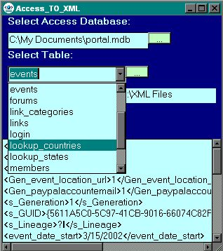

<div align="center">

## Access\_TO\_XML


</div>

### Description

Using this Program one can browse for Access Database through Network or local computer, pick a table you want to make an XML file from, and finally push a button to create a file in XML format. One can also display the newly created XML file and print it into Textbox with further "copy-and-paste".

For database browsing I used an API call: GetOpenFileName Lib "comdlg32.dll" instead of bulky CommonDialog Control.

For getting a tablenames of the database I used OpenSchema(adSchemaTables)for create Connection and then simply added tablenames into Combobox.

Then I used File access VB feature to write an XML file from access table, reading column names and columns, converting it into XML format and writing on disk.

The last feature this program has to print out a newly created XML file into Textbox for analysis and, if necessary, "copy-and-paste".
 
### More Info
 
All the inputs are: Access Database Path and name like: C:\My Databases\MyData.mdb

I use "Browse for files" using API call:

GetOpenFileName Lib "comdlg32.dll", it works faster.

Just unzip and upload into your directory.

Ready to go XML file. The default directory is the Project directory, can be simply modified.

There are no side effects besides the necessaty to customize an Output directory.


<span>             |<span>
---                |---
**Submitted On**   |2002-04-07 21:18:16
**By**             |[Tata's](https://github.com/Planet-Source-Code/PSCIndex/blob/master/ByAuthor/tata-s.md)
**Level**          |Advanced
**User Rating**    |4.8 (43 globes from 9 users)
**Compatibility**  |VB 6\.0
**Category**       |[Databases/ Data Access/ DAO/ ADO](https://github.com/Planet-Source-Code/PSCIndex/blob/master/ByCategory/databases-data-access-dao-ado__1-6.md)
**World**          |[Visual Basic](https://github.com/Planet-Source-Code/PSCIndex/blob/master/ByWorld/visual-basic.md)
**Archive File**   |[Access\_TO\_69939482002\.zip](https://github.com/Planet-Source-Code/tata-s-access-to-xml__1-33542/archive/master.zip)

### API Declarations

```
Private Declare Function GetOpenFileName Lib "comdlg32.dll" Alias _
"GetOpenFileNameA" (pOpenfilename As OPENFILENAME) As Long
```


